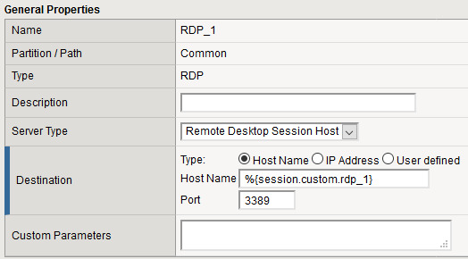

# APM Advanced Resource Assignment from iRule

Just a bookmark for this [article](https://devcentral.f5.com/s/question/0D51T00008Ow1UOSAZ/apm-advanced-resource-assignment-from-irule).

The main goal would be to dynamically assign up to n numbers of RDP resources to the session based on a comma separated list from a AD attribute. 


There are for example 10 RDP resources, each with it's own variable containing the destination. In the RDP resource we can pass this like this:



After the AD query I can phrase the values in an iRule like:

```
set MYSTRING "192.0.0.1,192.0.0.2,192.0.0.3,fqdn.test.eu,fqdn2.example.com"

# or it could be set MYSTRING [ACCESS::session data get {session.ad.last.attr.mycustomattr}]

set ADDRESSARRAY [split $MYSTRING ","]
 
foreach ADDR $ADDRESSARRAY {
    ACCESS::session data set {session.custom.rdp_$n} $ADDR
}
```

And instead of assigning the resource from the iRule, I assign all of them based in their own variable. If there is a destination then the resource should appear if it is empty it should not. 


Resource customization via caption in variable:

